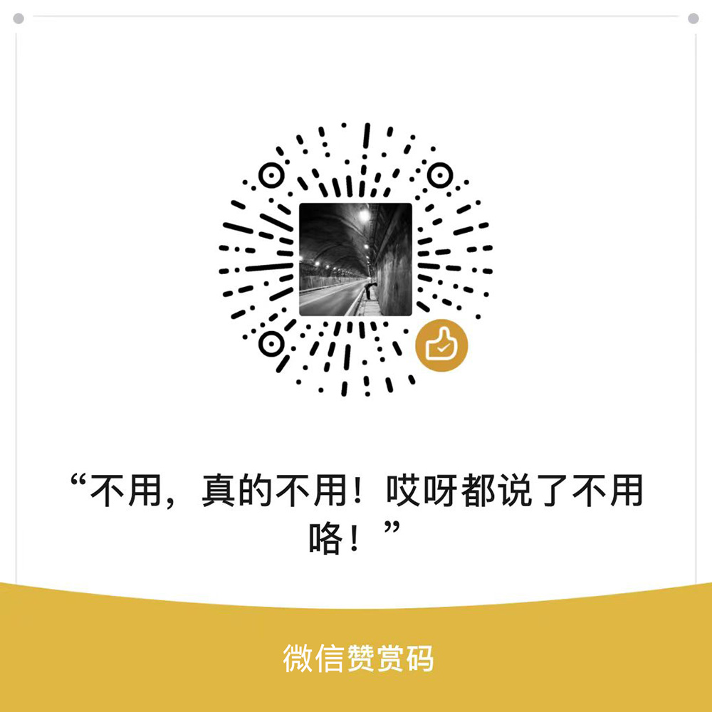

## Adi's Blogs

### 记录一下技术路上看到的，遇到的，做过的，或者无关技术的。
> **以该仓库内的Issues作为Blog源，一个issue，一篇文章。所有的issue会同步到[我的博客](https://adiovo.cc)上，若issue closed，则文章会隐藏。**


## Issue与Blog的数据结构关系

| X | Issue（仓库源） | Blog（博客） |
| --------- | --------- | --------- |
| 文章分类（Category/Milestone） | milestone | 文章分类 |
| 文章标题（Title） | title | 文章标题 |
| 文章正文（Content） | body | 文章内容 |
| 文章标签（Tags/Labels） | labels | 文章标签（Multiple） |


```
Tags/Labels：可以为一个文章打上多个标签
Category/Milestone：通常为一个文章设置一个分类
```


## 说点什么
更新的非常随缘，但很真实，实践度和思考度达99%。<br />
感谢阅读，感谢Star Very much~


## 赞助博客

如果我的文章或项目能给你带来便利的话，考虑请作者喝杯咖啡吗？

<p>
  
  
</p>
